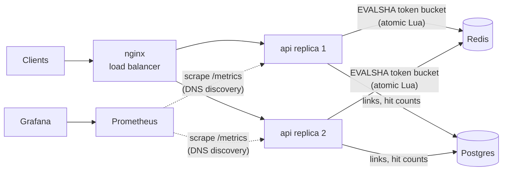

# ratelimited-api

[](https://github.com/Salar24/ratelimited-api/actions/workflows/ci.yml)


A URL-shortening API in Go built around a **distributed token-bucket rate limiter**. Limits are enforced atomically in Redis, so they hold no matter how many replicas are running. The stack includes Postgres storage, Prometheus metrics, a provisioned Grafana dashboard, and an end-to-end CI check that proves the limit is shared across instances.

> ☸️ **Kubernetes deployment:** see [**k8s-platform**](https://github.com/Salar24/k8s-platform) for the Helm chart, ArgoCD GitOps setup, and end-to-end tests on a multi-node cluster, and [**terraform-aws-platform**](https://github.com/Salar24/terraform-aws-platform) for the AWS infrastructure (EKS, RDS, ElastiCache).

## Architecture



## Highlights

- **Atomic, distributed rate limiting.** Refill and consume happen in a single Lua script, so there are no read-modify-write races between replicas. The script uses Redis's `TIME` rather than app clocks, so clock skew between instances doesn't matter.
- **Two interchangeable backends.** Redis for multi-instance deployments; an in-memory limiter, with a janitor that evicts idle buckets, for single-instance or local runs. Both implement one `Limiter` interface.
- **Explicit failure policy.** If Redis is unreachable, the service either **fails open** (serves traffic and counts the error in `ratelimit_decisions_total{decision="error"}`) or **fails closed** (returns 503), depending on `RATE_LIMIT_FAIL_OPEN`.
- **Standard rate-limit headers.** Responses carry `X-RateLimit-Limit` and `X-RateLimit-Remaining`, and a `429` also carries `Retry-After`.
- **Hard to spoof behind a proxy.** With `TRUST_PROXY=true`, the client IP is the last `X-Forwarded-For` hop, the one your proxy observed. Earlier hops are client-controlled and ignored.
- **Observability built in.** RED metrics are labelled by route *pattern* (bounded cardinality), with structured JSON logs and request IDs propagated through `X-Request-ID`.
- **Production-minded server.** Graceful shutdown on SIGTERM, read/write/idle timeouts, request body limits, and a distroless non-root image.

## Quick start

```bash
docker compose up -d --build
```

| Service    | URL                     |
|------------|-------------------------|
| API        | http://localhost:8080   |
| Grafana    | http://localhost:3000   |
| Prometheus | http://localhost:9090   |

```bash
# Create a short link
curl -s -X POST localhost:8080/api/v1/links \
  -d '{"url":"https://go.dev","code":"golang"}'
# {"code":"golang","url":"https://go.dev","hits":0,"created_at":"...","short_url":"http://localhost:8080/golang"}

# Follow it
curl -i localhost:8080/golang        # 302 Location: https://go.dev

# Hit the limit (burst 10, refill 5/s by default)
make load
#   13 200    <- burst of 10 plus tokens refilled during the run
#   37 429
```

Or run with no dependencies at all (in-memory store and limiter):

```bash
go run ./cmd/server
```

## API

| Method | Path                     | Description                                   | Rate limited |
|--------|--------------------------|-----------------------------------------------|:------------:|
| POST   | `/api/v1/links`          | Create a link. Body: `{"url": "...", "code": "optional-alias"}` | ✅ |
| GET    | `/api/v1/links/{code}`   | Link details including hit count              | ✅ |
| GET    | `/{code}`                | 302 redirect to the target URL                | ✅ |
| GET    | `/healthz`               | Liveness                                      | —  |
| GET    | `/readyz`                | Readiness (checks the store)                  | —  |
| GET    | `/metrics`               | Prometheus metrics                            | —  |

Errors are JSON: `{"error": "rate limit exceeded"}`.

## How the limiter works

Each client has a bucket holding up to `RATE_LIMIT_BURST` tokens that refills at `RATE_LIMIT_RPS` tokens per second. Every request costs one token; an empty bucket means `429` with `Retry-After` set to the time until the next token.

In Redis, each bucket is a hash `{tokens, ts}`. One script call:

1. reads the server time with `TIME`,
2. adds `elapsed × rate` tokens, capped at the burst,
3. takes one token if available,
4. writes the state back and sets a TTL equal to the full-refill time, so idle clients cost no memory.

Because Redis runs scripts one at a time, concurrent requests from any number of replicas see a consistent bucket. CI checks this with 100 concurrent goroutines against a burst of 25, expecting exactly 25 allowed.

## Configuration

| Variable               | Default                  | Description                                       |
|------------------------|--------------------------|---------------------------------------------------|
| `ADDR`                 | `:8080`                  | Listen address                                    |
| `BASE_URL`             | `http://localhost:8080`  | Used to build `short_url`                         |
| `DATABASE_URL`         | *(empty → in-memory)*    | Postgres DSN                                      |
| `REDIS_URL`            | *(empty → in-memory)*    | Redis URL, e.g. `redis://redis:6379/0`            |
| `RATE_LIMIT_RPS`       | `5`                      | Token refill rate per client                      |
| `RATE_LIMIT_BURST`     | `10`                     | Bucket capacity per client                        |
| `RATE_LIMIT_FAIL_OPEN` | `true`                   | Serve traffic if the limiter backend is down      |
| `TRUST_PROXY`          | `false`                  | Derive client IP from `X-Forwarded-For`           |
| `SHUTDOWN_TIMEOUT`     | `15s`                    | Graceful shutdown deadline                        |
| `LOG_LEVEL`            | `info`                   | `debug`, `info`, `warn`, `error`                  |

## Observability

The Grafana dashboard is provisioned automatically and shows request rate, the share of requests rate-limited, p50/p95/p99 latency per route, per-replica traffic, and limiter decisions over time.

| Metric                               | Type      | Labels                     |
|--------------------------------------|-----------|----------------------------|
| `http_requests_total`                | counter   | `method`, `route`, `status` |
| `http_request_duration_seconds`      | histogram | `method`, `route`          |
| `http_requests_in_flight`            | gauge     |                            |
| `ratelimit_decisions_total`          | counter   | `decision` = allowed / limited / error |
| `links_created_total`, `link_redirects_total` | counter |                     |

## Testing & CI

```bash
make test               # unit tests
make test-integration   # + Redis and Postgres integration tests
make lint
```

Each push runs three GitHub Actions jobs:

1. **Lint & test:** golangci-lint, then unit tests plus Redis and Postgres integration tests under the race detector.
2. **End-to-end:** brings up the full Compose stack (2 replicas behind nginx) and checks that the rate limit is **shared** across replicas and that Prometheus discovers both targets.
3. **Publish image:** pushes to `ghcr.io/salar24/ratelimited-api` on `main`.

## Project layout

```
cmd/server/          entrypoint: config, wiring, graceful shutdown
internal/ratelimit/  Limiter interface, Redis (Lua) and in-memory token buckets
internal/store/      Store interface, Postgres and in-memory implementations
internal/httpapi/    routes, handlers, middleware (rate limit, metrics, logging)
internal/metrics/    Prometheus collectors
internal/shortcode/  crypto-random base62 codes, alias validation
migrations/          embedded SQL schema
deploy/              nginx, Prometheus, Grafana provisioning + dashboard
```

## License

MIT
